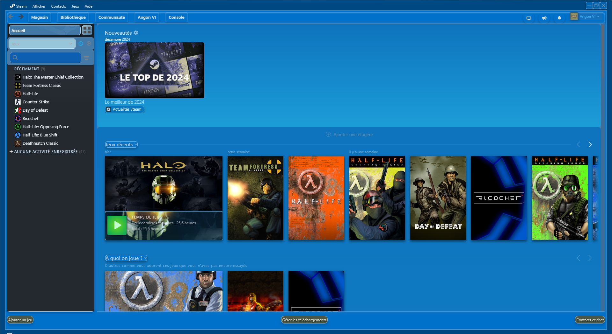

# RetroWave [Blue]

🎨 **RetroWave [Blue]** is a Steam theme inspired by retro-futuristic vibes, featuring a blue-dominated color palette for an immersive visual experience.

## 🌟 Features
- Retro-futuristic colors (shades of blue).
- Optimized interface for better readability.
- Minimalist and modern design.

## 📥 Installation
1. Download the `.zip` file for the theme from the [Releases](https://github.com/your-username/RetroWave-Blue/releases) section.
2. Extract the downloaded file.
3. Copy the theme folder to your Steam skins directory:
   - **Windows**: `C:\Program Files (x86)\Steam\steamui\skins`

4. Open Steam, then:
   - Go to **Settings** > **Interface**.
   - Select **RetroWave [Blue]** from the skins dropdown menu.
   - Restart Steam.

## 🖼️ Preview
Here’s a preview of the theme in action:

## 🚀 Contributions
Contributions are welcome! If you want to suggest changes or improve the theme, please create a pull request.

---

This project is based on the OldSteam theme from MapleAtMorning
https://steambrew.app/theme?id=8YTvx3fAAfwQSu6MNOfH